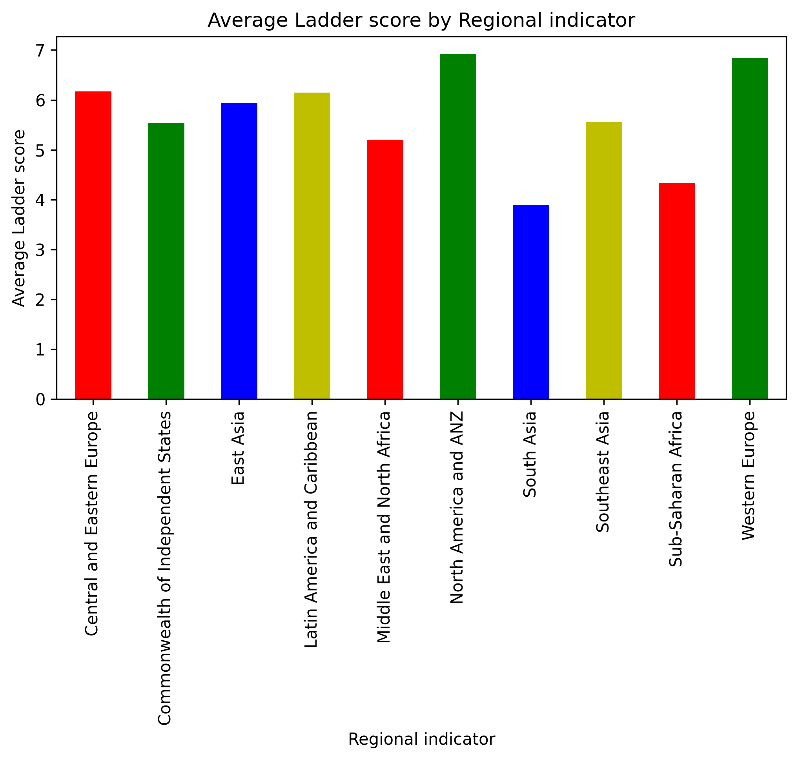
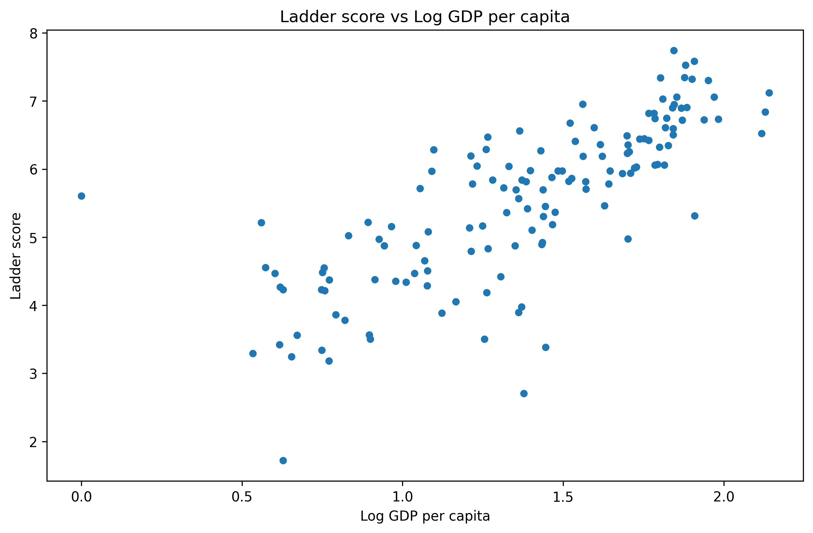
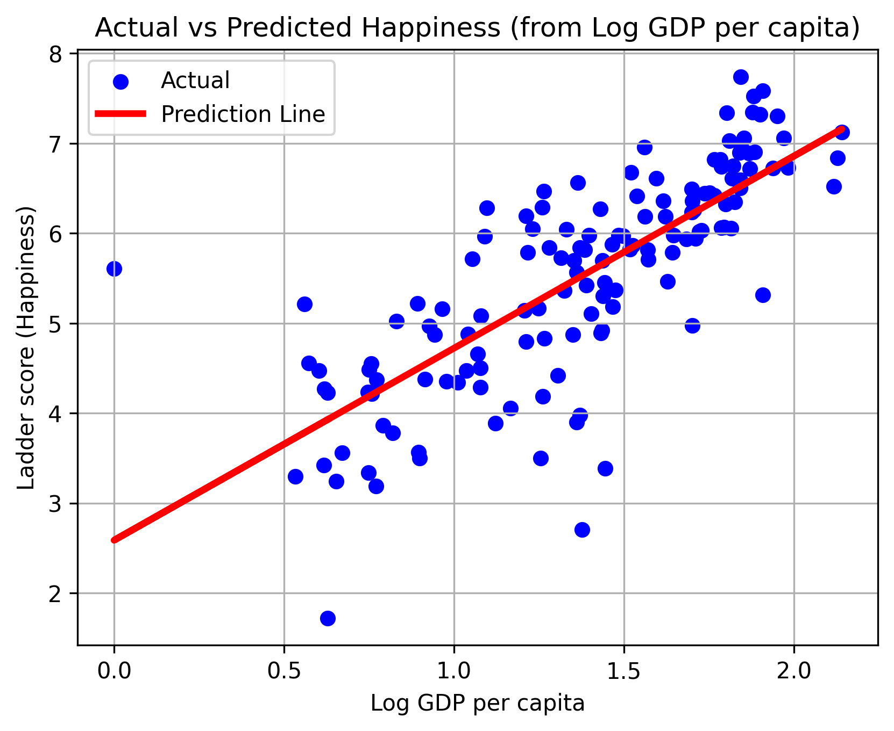

# World Happiness Report 2024 Analysis

**What really makes people happy?**  
An exploratory data analysis of the 2024 World Happiness Report using Python, Pandas, and Matplotlib.

## Key Insights
- Nordic countries dominate the top rankings
- **Social support** and **healthy life expectancy** are stronger predictors than GDP
- **Freedom to make life choices** has a major impact
- Regional disparities are significant

## Notebook
- [WorldHappiness.ipynb](WorldHappiness.ipynb)

## Data Source
- World Happiness Report 2024

## Tools
- Python
- Pandas
- Matplotlib
- Scikit-learn (basic linear regression)

Built by Omar Gisseh | December 2025
